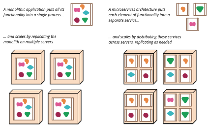
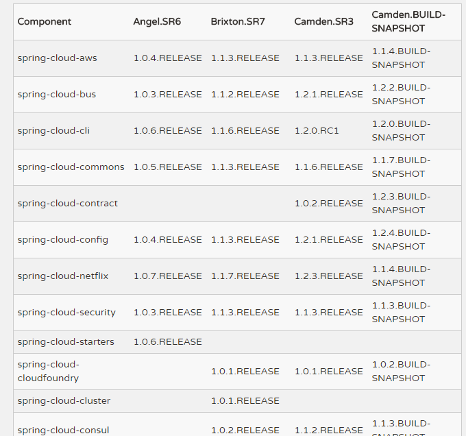
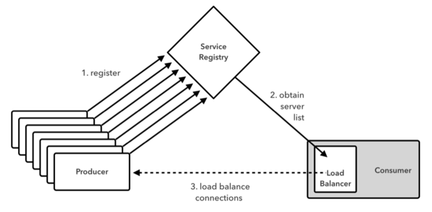
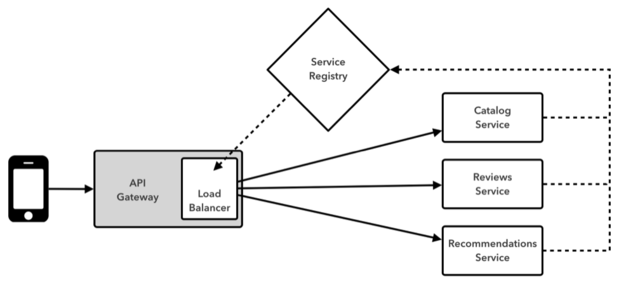
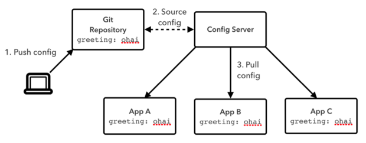
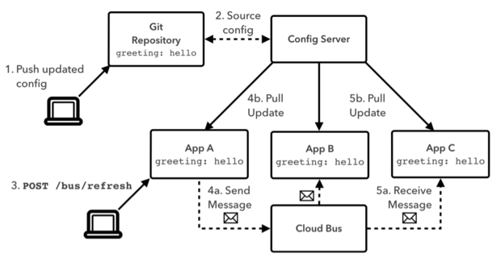
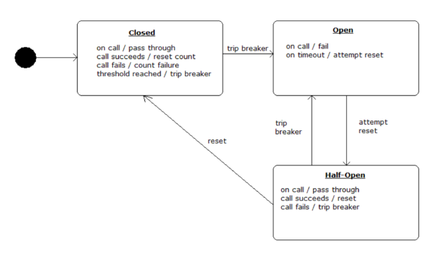
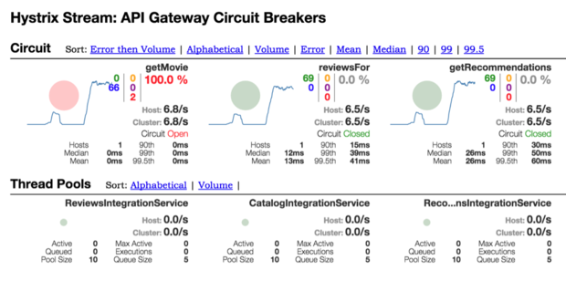
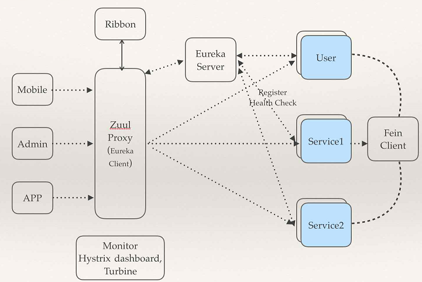
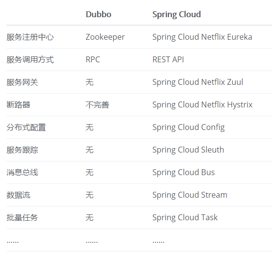

##使用Spring Cloud构建微服务架构应用

为了从业务和技术方面得到更好的扩展能力，我们将单一架构的系统(Monolithic architecture)，拆分成若干的微服务(Microservices architecture)，这种拆分是架构演进的一个过程。在整个拆分过程中，对团队的组织架构，数据的管理方式，部署监控技术方面都带来极大的挑战。

**分享内容大纲:**

1. 单体架构的优缺点
2. 微服务架构
3. Spring Cloud 介绍
4. Spring Cloud Demo演示
5. Spring Cloud 与 Dubbo

###1. 单体架构的优缺点

**优点：**

- 易于开发： 开发方式简单，IDE 支持好，方便运行和调试。
- 易于测试： 所有功能运行在一个进程中，一旦进程启动，便可以进行系统测试。
- 易于部署： 只需要将打好的一个软件包发布到服务器即可。
- 易于水平伸缩： 只需要创建一个服务器节点，配置好运行时环境，再将软件包发布到新服务器节点即- - 可运行程序（当然也需要采取分发策略保证请求能有效地分发到新节点）。

**缺点：**

- 维护成本大： 当应用程序的功能越来越多、团队越来越大时，沟通成本、管理成本显著增加。当出现 bug 时，可能引起 bug 的原因组合越来越多，导致分析、定位和修复的成本增加；并且在对全局功能缺乏深度理解的情况下，容易在修复 bug 时引入新的 bug。
- 持续交付周期长： 构建和部署时间会随着功能的增多而增加，任何细微的修改都会触发部署流水线。
- 新人培养周期长： 新成员了解背景、熟悉业务和配置环境的时间越来越长。
- 技术选型成本高： 单块架构倾向于采用统一的技术平台或方案来解决所有问题，如果后续想引入新的技术或框架，成本和风险都很大。
- 可扩展性差： 随着功能的增加，垂直扩展的成本将会越来越大；而对于水平扩展而言，因为所有代码都运行在同一个进程，没办法做到针对应用程序的部分功能做独立的扩展。

###2. 微服务架构

####2.1 定义

　　微服务架构是一种架构模式，它提倡将单一应用程序划分成一组小的服务，服务之间互相协调、互相配合，为用户提供最终价值。每个服务运行在其独立的进程中，服务于服务间采用轻量级的通信机制互相沟通（通常是基于 HTTP 的 RESTful API）。每个服务都围绕着具体业务进行构建，并且能够被独立地部署到生产环境、类生产环境等。另外，应尽量避免统一的、集中式的服务管理机制，对具体的一个服务而言，应根据业务上下文，选择合适的语言、工具对其进行构建。

####2.2 微服务架构使用场景

我们来看看一般的微服务架构需要的功能或使用场景：

- 我们把整个系统根据业务拆分成几个子系统。
- 每个子系统可以部署多个实例，多个实例之间使用负载均衡。
- 需要一个服务注册中心，所有的服务都在注册中心注册，负载均衡也是通过在注册中心注册的服务来使用一定策略来实现。
- 所有的客户端都通过同一个网关地址访问后台的服务，通过路由配置，网关来判断一个URL请求由哪个服务处理。请求转发到服务上的时候也使用负载均衡。
- 服务之间有时候也需要相互访问。例如有一个用户模块，其他服务在处理一些业务的时候，要获取用户服务的用户数据。
- 需要一个断路器，及时处理服务调用时的超时和错误，防止由于其中一个服务的问题而导致整体系统的瘫痪。
- 还需要一个监控功能，监控每个服务调用花费的时间等。

####2.3 微服务架构实施中的挑战
1. 分布式系统的复杂性  

	微服务架构是基于分布式的系统，而构建分布式系统必然会带来额外的开销。  
	**性能：** 分布式系统是跨进程、跨网络的调用，受网络延迟和带宽的影响。  
	**可靠性：** 由于高度依赖于网络状况，任何一次的远程调用都有可能失败，随着服务的增多还会出现更多的潜在故障点。因此，如何提高系统的可靠性、降低因网络引起的故障率，是系统构建的一大挑战。  
	**异步：** 异步通信大大增加了功能实现的复杂度，并且伴随着定位难、调试难等问题。  
	**数据一致性：** 要保证分布式系统的数据强一致性，成本是非常高的，需要在 C（一致性）A（可用性）P（分区容错性） 三者之间做出权衡。
2. 运维成本  
	
	运维主要包括配置、部署、监控与告警和日志收集四大方面。微服务架构中，每个服务都需要独立地配置、部署、监控和收集日志，成本呈指数级增长。
3. 自动化部署  
	
	在微服务架构中，每个服务都独立部署，交付周期短且频率高，人工部署已经无法适应业务的快速变化。因此如何有效地构建自动化部署体系，是微服务面临的另一个挑战。
4. DevOps 与组织架构  
	
	在微服务架构的实施过程中，开发人员和运维人员的角色发生了变化，开发者将承担起整个服务的生命周期的责任，包括部署和监控；而运维则更倾向于顾问式的角色，尽早考虑服务如何部署。因此，按需调整组织架构、构建全功能的团队，也是一个不小的挑战。
5. 服务间的依赖测试  
	
	单块架构中，通常使用集成测试来验证依赖是否正常。而在微服务架构中，服务数量众多，每个服务都是独立的业务单元，服务主要通过接口进行交互，如何保证依赖的正常，是测试面临的主要挑战。
6. 服务间的依赖管理  
	
	微服务架构中，服务数量众多，如何清晰有效地展示服务间的依赖关系也是个不小的挑战。

微服务的落地需要经过全面的考察和完善的试验，并不是每个场景都适合使用微服务架构，也不是每个企业都有能力或者精力去面对这些挑战。

----------

###3. Spring Cloud 介绍
 
Spring Cloud是基于Spring Boot的一整套实现微服务的框架。他提供了微服务开发所需的配置管理、服务发现、断路器、智能路由、微代理、控制总线、全局锁、决策竞选、分布式会话和集群状态管理等组件。最重要的是，跟spring boot框架一起使用的话，会让你开发微服务架构的云服务非常好的方便。

----------

####3.1 关于版本号

Spring Cloud是一个拥有诸多子项目的大型综合项目，原则上其子项目也都维护着自己的发布版本号。那么每一个Spring Cloud的版本都会包含不同的子项目版本，为了要管理每个版本的子项目清单，避免版本名与子项目的发布号混淆，所以没有采用版本号的方式，而是通过命名的方式。比如：Angel.SR6，Brixton.SR7，Camden.SR3等等

这些版本名字采用了伦敦地铁站的名字，根据字母表的顺序来对应版本时间顺序，比如：最早的Release版本：Angel，第二个Release版本：Brixton，以此类推……

当一个版本的Spring Cloud项目的发布内容积累到临界点或者一个严重bug解决可用后，就会发布一个“service releases”版本，简称SRX版本，其中X是一个递增数字。

... ...
----------

####3.2 Eureka 服务注册和发现  

Eureka 提供了一个服务注册中心、服务发现的客户端，还有一个方便的查看所有注册的服务的界面。 所有的服务使用Eureka的服务发现客户端来将自己注册到Eureka的服务器上。

----------

####3.3 Feign 服务客户端

服务客户端，服务之间如果需要相互访问，可以使用 RestTemplate，也可以使用Feign客户端访问。它默认会使用Ribbon来实现负载均衡。

----------

####3.4 Ribbon 客户端负载均衡

Ribbon是一个基于HTTP和TCP客户端的负载均衡器。Feign中也使用Ribbon。

----------

####3.5 Zuul 服务网关(智能路由)  

客户端请求可以通过这个网关访问后台的服务。他可以使用一定的路由配置来判断某一个URL由哪个服务来处理。并从Eureka获取注册的服务来转发请求。

为什么服务网关是微服务架构的重要部分：

- 不仅仅实现了路由功能来屏蔽诸多服务细节，更实现了服务级别、均衡负载的路由。
- 实现了接口权限校验与微服务业务逻辑的解耦。通过服务网关中的过滤器，在各生命周期中去校验请求的内容，将原本在对外服务层做的校验前移，保证了微服务的无状态性，同时降低了微服务的测试难度，让服务本身更集中关注业务逻辑的处理。
- 实现了断路器，不会因为具体微服务的故障而导致服务网关的阻塞，依然可以对外服务。

----------

####3.6 Spring Cloud Config Server

简单来说，Spring Cloud Config就是我们通常意义上的配置中心。 

Spring Cloud Config 把应用原本放在本地文件的配置抽取出来放在中心服务器，从而能够提供更好的管理、发布能力。

Spring Cloud Config分服务端和客户端，服务端负责将git（svn）中存储的配置文件发布成REST接口，客户端可以从服务端REST接口获取配置。但客户端并不能主动感知到配置的变化，从而主动去获取新的配置，这需要每个客户端通过POST方法触发各自的/refresh。

----------

####3.7 Spring Cloud Bus

事件、消息总线，用于在集群（例如，配置变化事件）中传播状态变化，可与Spring Cloud Config联合实现热部署。

----------

####3.8 Hystrix 监控和断路器

当某个服务单元发生故障（类似用电器发生短路）之后，通过断路器的故障监控（类似熔断保险丝），向调用方返回一个错误响应，而不是长时间的等待。这样就不会使得线程因调用故障服务被长时间占用不释放，避免了故障在分布式系统中的蔓延。

我们只需要在服务接口上添加Hystrix标签，就可以实现对这个接口的监控和断路器功能。

Hystrix Dashboard，监控面板，他提供了一个界面，可以监控各个服务上的服务调用所消耗的时间等。

----------

####3.9 其他 Spring Cloud 子项目

- Archaius  
配置管理API，包含一系列配置管理API，提供动态类型化属性、线程安全配置操作、轮询框架、回调机制等功能。

- Consul  
封装了Consul操作，consul是一个服务发现与配置工具，与Docker容器可以无缝集成。

- Spring Cloud for Cloud Foundry  
通过Oauth2协议绑定服务到CloudFoundry，CloudFoundry是VMware推出的开源PaaS云平台。

- Spring Cloud Sleuth  
日志收集工具包，封装了Dapper和log-based追踪以及Zipkin和HTrace操作，为SpringCloud应用实现了一种分布式追踪解决方案。

- Spring Cloud Data Flow  
大数据操作工具，作为Spring XD的替代产品，它是一个混合计算模型，结合了流数据与批量数据的处理方式。

- Spring Cloud Security  
基于spring security的安全工具包，为你的应用程序添加安全控制。

- Spring Cloud Zookeeper  
操作Zookeeper的工具包，用于使用zookeeper方式的服务发现和配置管理。

- Spring Cloud Stream  
数据流操作开发包，封装了与Redis,Rabbit、Kafka等发送接收消息。

- Spring Cloud CLI  
基于 Spring Boot CLI，可以让你以命令行方式快速建立云组件。

- Turbine  
Turbine是聚合服务器发送事件流数据的一个工具，用来监控集群下hystrix的metrics情况。

- Spring Cloud Task  
提供云端计划任务管理、任务调度。

- Spring Cloud Connectors  
便于云端应用程序在各种PaaS平台连接到后端，如：数据库和消息代理服务。

- Spring Cloud Cluster  
提供Leadership选举，如：Zookeeper, Redis, Hazelcast, Consul等常见状态模式的抽象和实现。

- Spring Cloud Starters  
Spring Boot式的启动项目，为Spring Cloud提供开箱即用的依赖管理。。

###4. Spring Cloud Demo演示

通过Eureka实现服务注册中心以及服务注册与发现；  
服务间通过Ribbon或Feign实现服务的消费以及均衡负载；  
通过Spring Cloud Config实现应用多环境的外部化配置以及版本管理；  
为了使得服务集群更为健壮，使用Hystrix的融断机制来避免在微服务架构中个别服务出现异常时引起的故障蔓延；

###5. Spring Cloud 与 Dubbo

微服务架构的基础框架选择：Spring Cloud还是Dubbo？  
[http://blog.didispace.com/microservice-framework/](http://blog.didispace.com/microservice-framework/ "微服务架构的基础框架选择：Spring Cloud还是Dubbo？")

这篇文章通过背景、社区活跃度、架构完整度、文档质量等多个维度对Spring Cloud和Dubbo进行了比较。
文章结论如下：

- 背景：  
	如果拿Dubbo与Netflix套件做对比，前者在国内影响力较大，后者在国外影响力较大，我认为在背景上可以打个平手；但是若要与Spring Cloud做对比，由于Spring Source的加入，在背书上，Spring Cloud略胜一筹。不过，英雄不问出处，在背景这一点上，不能作为选择框架的主要因素，当您一筹莫展的时候，可以作为参考依据。

- 社区活跃度：  
	在社区活跃度上，Spring Cloud毋庸置疑的优于Dubbo，这对于没有大量精力与财力维护这部分开源内容的团队来说，Spring Cloud会是更优的选择。

- 架构完整度  
	或许很多人会说Spring Cloud和Dubbo的对比有点不公平，Dubbo只是实现了服务治理，而Spring Cloud下面有17个子项目（可能还会新增）分别覆盖了微服务架构下的方方面面，服务治理只是其中的一个方面，一定程度来说，Dubbo只是Spring Cloud Netflix中的一个子集。但是在选择框架上，方案完整度恰恰是一个需要重点关注的内容。
	
	  
	
	Dubbo实现了服务治理的基础，但是要完成一个完备的微服务架构，还需要在各环节去扩展和完善以保证集群的健康，以减轻开发、测试以及运维各个环节上增加出来的压力，这样才能让各环节人员真正的专注于业务逻辑。而Spring Cloud依然发扬了Spring Source整合一切的作风，以标准化的姿态将一些微服务架构的成熟产品与框架揉为一体，并继承了Spring Boot简单配置、快速开发、轻松部署的特点，让原本复杂的架构工作变得相对容易上手一些。
	
	所以，如果选择Dubbo请务必在各个环节做好整套解决方案的准备，不然很可能随着服务数量的增长，整个团队都将疲于应付各种架构上不足引起的困难。而如果选择Spring Cloud，相对来说每个环节都已经有了对应的组件支持，可能有些也不一定能满足你所有的需求，但是其活跃的社区与高速的迭代进度也会是你可以依靠的强大后盾。

- 文档质量  
	虽然Spring Cloud的文档量大，但是如果使用Dubbo去整合其他第三方组件，实际也是要去阅读大量第三方组件文档的，所以在文档量上，我觉得区别不大。对于文档质量，由于Spring Cloud的迭代很快，难免会出现不一致的情况，所以在质量上我认为Dubbo更好一些。而对于文档语言上，Dubbo自然对国内开发团队来说更有优势。

- 总结   
	通过上面再几个环节上的分析，相信大家对Dubbo和Spring Cloud有了一个初步的了解。就我个人对这两个框架的使用经验和理解，打个不恰当的比喻：使用Dubbo构建的微服务架构就像组装电脑，各环节我们的选择自由度很高，但是最终结果很有可能因为一条内存质量不行就点不亮了，总是让人不怎么放心，但是如果你是一名高手，那这些都不是问题；而Spring Cloud就像品牌机，在Spring Source的整合下，做了大量的兼容性测试，保证了机器拥有更高的稳定性，但是如果要在使用非原装组件外的东西，就需要对其基础有足够的了解。

	从目前Spring Cloud的被关注度和活跃度上来看，很有可能将来会成为微服务架构的标准框架。

参考： 

《官方文档》
http://cloud.spring.io/spring-cloud-static/Camden.SR3/
 
《成小胖学习微服务架构·基础篇》  
http://www.toutiao.com/i6372299080709702146/

《微服务技术栈选型，看了这个别的可以不用看了》  
http://www.toutiao.com/a6348181275526938882/

《利用Zipkin对Spring Cloud应用进行服务追踪分》  
http://www.toutiao.com/a6328171100883271937/

《Spring Cloud netflix概览和架构设计》  
http://codin.im/2016/12/15/spring-cloud-architect-intro/

《程序猿DD-SpringBoot-Learning》
http://git.oschina.net/didispace/SpringBoot-Learning

《7天学会，spring cloud系列》
https://git.oschina.net/zhou666/spring-cloud-7simple

